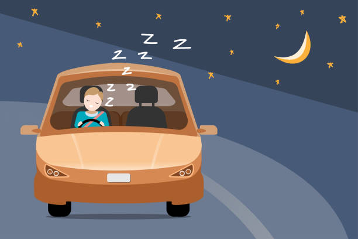
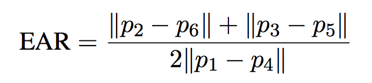
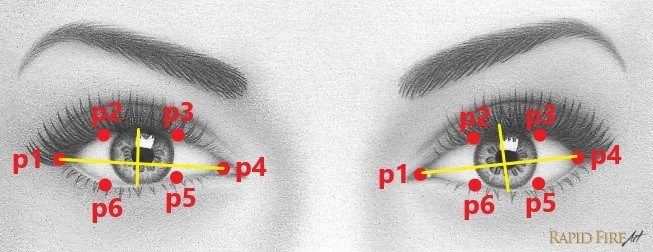

## About The Project

<div align="center" id="about-the-project">

 </div>
The attention level of driver degrade because of less sleep, long continuous driving or any
other medical condition like brain disorders etc. Several surveys on road accidents says that
around 30 percent of accidents are caused by fatigue of the driver. When driver drives for
more than normal period for human then excessive fatigue is caused and also results in
tiredness which drives the driver to sleepy condition or loss of consciousness. Drowsiness is a
complex phenomenon which states that there is a decrease in alerts and conscious levels of
the driver. It might be caused by an absence of rest, medicine, substance misuse, or a
cerebral issue. It is mostly the result of fatigue which can be both mental and physical.
Physical fatigue, or muscle weariness, is the temporary physical failure of a muscle to
perform ideally. Mental fatigue is a temporary failure to keep up ideal psychological
execution.
Though there is no direct measure to detect the drowsiness but several indirect methods can
be used for this purpose.
Several measures are available for the measurement of drowsiness which includes the
following:
1. Vehicle based measures
2. Physiological measures
3. Behavioural measures

<h4>Proposed Method</h4>
This approach will be mostly focused on the amount of eye ratio also called (EAR) Eye Aspect Ratio as it provides the most accurate information on drowsiness. It is also non-intrusive, hence does not affect the state of the driver, and also the driver feels comfortable with this system. Environmental factors like road conditions do not affect this system. The case of micro nap is also detected according to the given threshold value. The development of this system includes face identification and tracking, detection and location of the human eye, human eye tracking, eye state detection, and driver fatigue testing. 
<p align="right">(<a href="#top">↑</a>)</p>


### Built With
* [OpenCV](https://opencv.org)
* [Numpy](https://NumPy.org/)
* [Dlib](https://dlib.net/)
* [Imutils](https://github.com/PyImageSearch/imutils)
* [Pygame](https://pygame.org/)
* [Flask](https://flask.palletsprojects.com/en/2.0.x/)
* [Bootstrap](https://getbootstrap.com)
* [JQuery](https://jquery.com)

<p align="right">(<a href="#top">↑</a>)</p>


## Getting Started
This is an example of how you may give instructions on setting up your project locally.
To get a local copy up and running follow these simple example steps.

### Test Bed

i.	IDE- Jupyter Notebook 6.4.5

ii.	System benchmarks:

  •	OS   - Windows 10
  
  •	CPU – AMD Ryzen 3
  
  •	GPU – Radeon Vega 8 
  
  •	RAM – 8GB

### Prerequisites
The requirement for this Python project is a webcam through which we will capture images.<br />
We need to have Python ([3.6](https://www.python.org/downloads/release/python-360/) version recommended) installed on your system.<br />
Any IDE would be good to run the project([Pycharm](https://www.jetbrains.com/pycharm/download/#section=windows) Recommended ).<br />
* check version of python installed
  ```sh
  py --version
  ```
Install [GitBash](https://git-scm.com/download/win) to clone the repo or just [download](https://github.com/BSH2409/Minor_Project/archive/refs/heads/main.zip) the repo.
* check version of git installed
  ```sh
  git --version
  ```

### Installation
1. Clone the repo
   ```sh
   git clone https://github.com/PriyaSangwan/RoadAccidents-Prevention-System.git
   ```
2. Install pip packages 
  (Taking assumption that python was installed successfully)
  * OpenCV
  ```sh
  pip install opencv-python
  ```
  * Numpy
  ```sh
  pip install numpy
  ```
  * Dlib
  To install Dlib first install Cmake
  ```sh
  pip install cmake
  pip install dlib
  ```
  * imutils
  ```sh
  pip install imutils
  ```
  * Pygame
  ```sh
  pip install pygame
  ```
  * Flask
  ```sh
  pip install flask
  ```
3. Run the [app.py](https://github.com/PriyaSangwan/Drowsiness_Detection/blob/main/app.py) in your IDE

Voilà, All Set.

<p align="right">(<a href="#top">↑</a>)</p>

## Advantages

• The detected abnormal behavior is corrected through alarms in real time.<br />
• Component establishes interface with other drivers very easily.<br />
• Life of the driver can be saved by alerting him using the alarm system.<br />
• Speed of the vehicle can be controlled.<br />
• Traffic management can be maintained by reducing accidents.<br />
• Practically applicable<br />

## Applications
• This system can be used in factories to alert the workers.<br />
• If found drowsy, the alarm system gets activated and the driver is alerted.<br />
• If there is any obstacles it is alerted to the driver.<br />
• This system can also be used for railway drivers.<br />

<p align="right">(<a href="#top">↑</a>)</p>


## Project Design

### Model Design
The below image is an example of a Dlib's 68 points model. There we can see that points from 1 to 68. But sometimes we don't need all 68 feature points, then for that, we will use only the eye landmarks and customize those points according to our requirements.
<div align="center"></div><br />
We need to initialize dlib’s HOG + Linear SVM-based face detector and then load the facial landmark predictor from disk:

```sh
  detector = dlib.get_frontal_face_detector()
  predictor = dlib.shape_predictor("predictor\\shape_predictor_68_face_landmarks.dat")
```
For further References on Dlib visit : 
[Facial Landmark](https://www.pyimagesearch.com/2017/04/03/facial-landmarks-dlib-opencv-python/)

Drowsiness Classifier:
Drowsiness Classifier: the EAR (Eye Aspect Ratio) is calculated to determine whether the user is active/drowsy/asleep. To do so, the ratio of height and width of the eye is determined to infer the open or close state of the eye. The ratio falls to approximately zero when the eye is closed but remains constant when they are open. 
<div align="center">
  <br />
  
 </div>


<p align="right">(<a href="#top">↑</a>)</p>

## Flow of the Program

1)	Image Capture
 Utilizing a web camera introduced inside the automobile we can get the picture of the driver. Even though the camera creates a video clip, we have to apply the developed algorithm on each edge of the video stream.<br>
2)	Dividing into Frames  
We are dealing with a real-time situation where the video is recorded and has to be processed. But the processing or application of the algorithm can be done only on an image. Hence the captured video has to be divided into frames for analysis. Adjusting brightness and converting into greyscale 
3)	Face Detection  <br>
i.	Detecting the facial landmarks using the Dlib model.<br>
ii.	Creating an ROI and returning the coordinates of the boundary box.<br>
iii.	Detect the eyes from ROI.<br>
iv.	Analyse and extract the landmarks of both the eyes.<br>
v.	Calculating the blink ratio (EAR).<br>
4)	Passing the parameters (Eye vertical and horizontal distance and EAR) to our trained classifier.
5)	Retrieving the status for each frame through our classifier.
6)	Determining whether the user is active/drowsy/sleep<br>
i.	Calculate the active/drowsy/sleep score that is simply the number of consecutive frames for which the user had been classified as active/drowsy/asleep.<br>
ii.	If the active/drowsy/sleep score is more than the threshold value, the program sets the current status of the user respectively.<br>
7)	Determining the threshold value:<br>
i.	As we know blinking of an eye or closing eye for a short duration of time can’t be counted in sleeping or drowsy status. To avoid the alarm for triggering in every frame in which the eyes are closed, a threshold must be set.<br>
ii.	The avg. blinking of an eye takes about 0.1 to 0.4 seconds (avg. ~0.2 seconds) and OpenCV works on 30 fps by default. Hence the number of frames for which sleeping can be ignored is 6 frames (30fps *0.2sec). Hence, the threshold is set to 6.<br>
8)	Triggering an alarm when the Status is SLEEPY.
9)	Returning a Json file consisting of Status, Avg. Sleep Time, Threat Level to the browser through WSGI routes to dynamically display the live details of the user.
<p align="right">(<a href="#top">↑</a>)</p>

## Data Set Used

i.  Open Eye Data Set- A huge data set of about 10,000 images of different regions, languages, skin tones were available.
Data Set Name- Labelled Faces in the Wild Home.

ii.	Drowsy Eye Data Set- No verified data set was found for drowsy data so we prepared our dataset for drowsy data.

iii.	Closed Eye Data Set- A moderate-size dataset of about 1,200 images was available with faces from different regions.
Data Set Name- Closed Eyes in The Wild

## Result and Output
* Web Application Template


